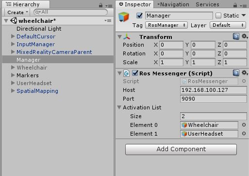
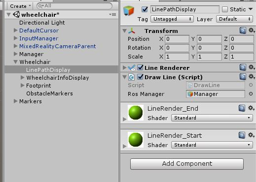

# hololens-rosbridge

This repository can be added into a Unity Hololens project and should work off-the-shelf.
It is an easy-to-use API that connects to rosbridge on the ROS master machine via websocket, based on the [holoROS](https://github.com/soliagabriel/holoROS) project done by Solia Gabriel.
Before starting your application on the Hololens, ensure that the rosbridge ROS package has been installed on the master ROS machine. To start the rosbridge server, run:
```
roslaunch rosbridge_server rosbridge_websocket.launch
```

# Setting up your project

First, create a `Manager` GameObject with the `RosMessenger` script as a child component via:



There are three parameters within RosMessenger:
* `Host`: The IP address of the ROS master node
* `Port`: The port of the rosbridge_websocket server (default: 9090)
* `Activation List`: A dynamic list of GameObject that communicates with ROS

It is vital that all GameObjects that communicate with rosbridge are set to inactive at the start of the application, and added into the `Activation List` parameter. RosMessenger will automatically activate the given list of GameObjects, as this will prevent any attempts by other GameObjects to publish/subscribe before RosMessenger is properly set up. The idea is to allow each script to have its own RosPublisher/RosSubscriber instances.

# Creating a custom script

The Unity-generated scripts can be used with slight modifications.
Ensure that the custom script inherits from RosComponent and not MonoBehaviour to inherit the `RosManager` member variable. 

```csharp
public class TestObject : RosComponent
{
        //...
}
```

At this stage, the `TestObject` component will have a new `Ros Manager` field in the Unity Editor (e.g. Draw Line script here):



Simply drag the `Manager` GameObject from the Hierarchy Window into the `Ros Manager` field in order to create the reference.

# Subscribing and Publishing

The following is an example of how to use a RosSubscriber and RosPublisher. 
Unlike the C++/Python implementations, there are no callback functions to be implmented when subscribing to a topic, since you can simply get a new message from the subscriber at every Update call.

First, instantiate all publishers/subscribers as member variables:
```csharp
public class TestObject : RosComponent
{
    RosSubscriber<ros.std_msgs.String> sub;
    RosPublisher<ros.std_msgs.String> pub;

    // ...
```

The `TestObject` class inherits the `Subscribe` and `Advertise` methods from `RosComponent`, which needs to be instantiated in the `Start` function in the following syntax:
```csharp

    // ...

    void Start(){
        
        // Create a new RosSubscriber by calling on the Subscribe function
        // Subscribe<T>(string name, string topic, double rate, out RosSubscriber<T> subscriber);
        Subscribe("TestSub", "/hololens/testsub", 5, out sub);

        // Create a new RosPublisher by calling on the Advertise function
        // Advertise<T>(string name, string topic, double rate, out RosPublisher<T> subscriber);
        Advertise("TestPub", "/hololens/testpub", 5, out pub);
        
        // ...

    }
    
    // ...

```


`TestObject` also inherits the `Publish` and `Receive` methods, which will return a boolean status result, indicating if the message has been successfully sent/received. A `false` value indicate that a previous message had been recently sent/received, and the current message has failed.
```csharp

    // ...
    void Update(){ 
        // To receive a message
        ros.std_msgs.String msg;
        
        if(Receive(sub, out msg)){
            // Perform operations with the received message
            // ...
        }

        // To publish a message
        ros.std_msgs.String resp = new ros.std_msgs.String("Hello World");
        if(Publish(pub, resp)){
            // ...
        }
    }
}
```

Currently, most of `std_msgs` and `geometry_msgs` have been implemented. More will be included in the future if necessary.

# Custom Messages

Custom messages are required to inherit the `IRosClassInterface` interface:

```csharp
public interface IRosClassInterface
{
    void FromJSON(JSONNode json);
    String ToJSON();
}
```
This is because the messages received from the rosbridge server is sent in JSON format, and each message type has to be handled appropriately. To get an idea of how to implement this, you can inspect `std_msgs` or `geometry_msgs`. The messages are also required to be under the `ros.custom_msgs` namespace:

```csharp
using namespace ros{

    using namespace custom_msgs{

        public class CustomMsg : IRosClassInterface{
            // ...
        }

    }
}
```
RosPublisher and RosSubscriber will use the namespace and class information to generate the appropriate rosmsg name, and pass it to rosbridge.


Note that Unity frame axes are different from ROS frame axes in two ways:
1. Y, Z axes in ROS correspond to Z, Y axes in Unity respectively
2. Positive angle in ROS follows the right-hand rule for rotation, whilst positive angle in Unity follows the left hand

There are a few methods to address this problem: 
1. A `(x, y, z)` position vector in ROS => `(x, z, y)` vector in Unity
2. A `(x, y, z)` rotation vector in ROS => `(-x, -z, -y)` vector in Unity
3. A `(x, y, z, w)` quaternion in ROS => `(x, z, y, -w)` quaternion in Unity

The C# implementation of the `geometry_msgs/Vector3` and `geometry_msgs/Quaternion` messages have `AsUnityVector` and `AsUnityQuaternion` fields available to perform the conversion automatically. 

```csharp
ros.geometry_msgs.Vector3 rosvec = new ros.geometry_msgs.Vector3();
// rosvec.x: ROS x-axis value
// rosvec.y: ROS y-axis value
// rosvec.z: ROS z-axis value

UnityEngine.Vector3 unityvec = rosvec.AsUnityVector;
// unityvec.x: ROS x-axis value
// unityvec.y: ROS z-axis value
// unityvec.z: ROS y-axis value
```


